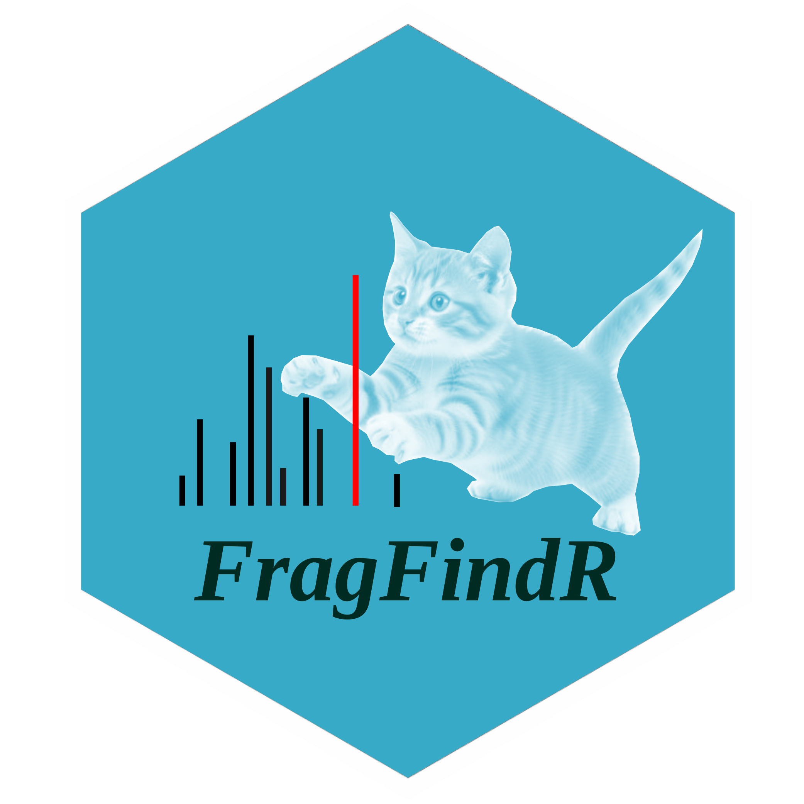

# FragFindR 

*FragFindR* is a shiny app designed to find MS/MS spectra peaks by fragment mass or fragment loss.

## Installation and Running

To install the *FragFindR* package, please use the following commands in *R* or *RStudio*:
```r
if (!requireNamespace("remotes", quietly = TRUE)) {
  install.packages("remotes")
}
if (!requireNamespace("BiocManager", quietly = TRUE)) {
  install.packages("BiocManager")
}

remotes::install_github("KrzysztofSolowiej/FragFindR", repos = BiocManager::repositories())
```
